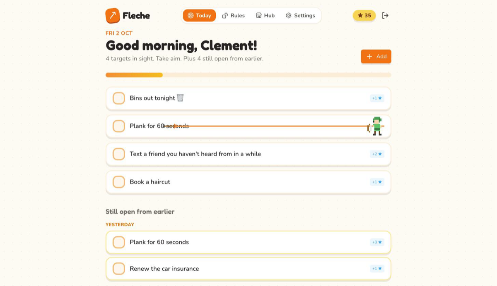
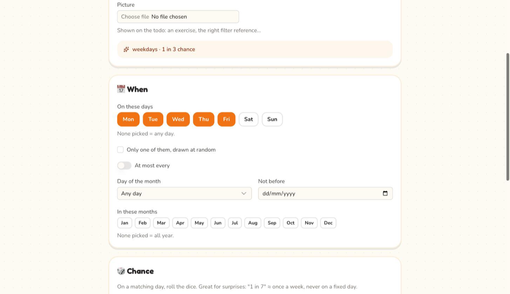
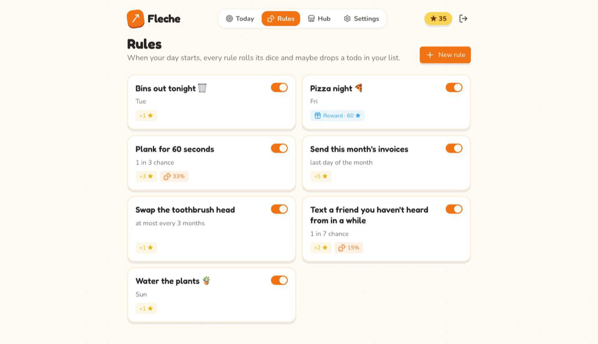
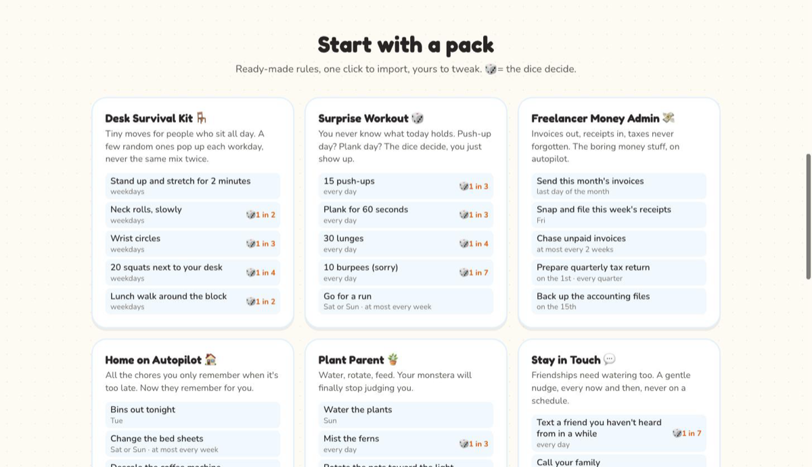
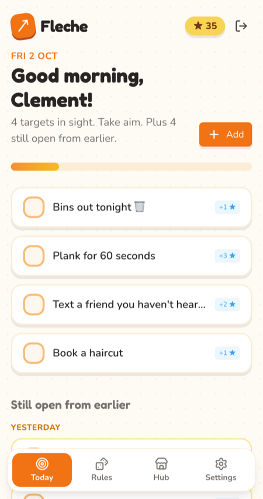
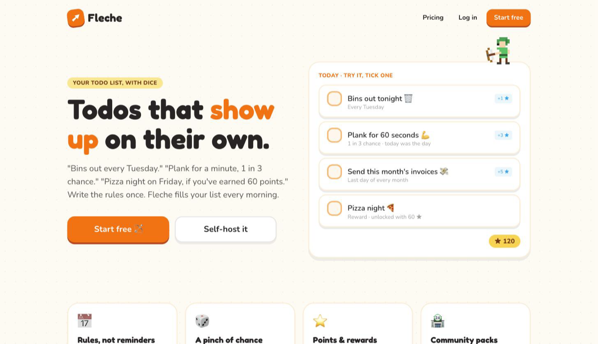

<div align="center">

# Fleche 🏹

**Todos that show up on their own. Sometimes by surprise.**

Write the rule once ("bins out every Tuesday", "plank for a minute, 1 in 3 chance").
Wake up to a list that's already made.
Tick a box and a tiny pixel archer shoots it down for you.

### 👉 [**Use it now on fleche.io**](https://fleche.io) 👈

*No install, no server, no terminal. Sign up, write a rule, done.*

[What it does](#what-it-does) · [The Reddit story](#reddit-made-me-do-it) · [Self-host it](#self-host-it) · [API](#api) · [Hack on it](#hack-on-it)



</div>

---

## Reddit made me do it

A few years ago, long before AI, I built myself a tiny web app. Every morning it
made my todo list from a set of rules: every Wednesday, *"take out the trash"*
showed up on its own. Exercises too. I've used it every day since and couldn't
live without it. Nobody else knew it existed.

Then someone posted their [home maintenance spreadsheet on r/OrganizationPorn](https://www.reddit.com/r/OrganizationPorn/comments/1wufo0r/home_maintenance_organization/)
and I left [a comment](https://www.reddit.com/r/OrganizationPorn/comments/1wufo0r/comment/pd2w2q3/)
about my app, ending with the fateful *"I should open source it some day."*

Reddit did not want "some day":

> **u/Salt-Operation**: *Yes you should. I'd love that.*
>
> **u/VVsmama88**: *Please do, I'm hopeless and need help with stuff like this desperately*
>
> **u/kilikikina**: *Same! Please do*
>
> **u/thats_a_money_shot**: *Please do*

I woke up the next morning (to a freshly generated todo list, obviously), saw the
upvotes, and typed **"OK I'LL DO IT!"** before my coffee.

Name ideas poured in: *Getshitdone* (I loved it), *Geshdo*, *Taskmaster*,
*BrainSpace*, *ToDo Done*. Every good name was already taken by about forty other
apps, so I went into my "app names for later" bucket and pulled out **Fleche**,
French for *arrow*. You aim at your day, you hit your targets. Hence the archer.

Someone also pointed out that plenty of recurring-task apps already exist. True!
But mine has one twist I've never seen anywhere else, and it's the reason I kept
using it: **rules can roll dice.** *"Push-ups, 1 in 5 chance."* Some mornings you
wake up and, apparently, today is push-up day. Surprise. 🎲

So here it is, rebuilt from scratch and open for everyone. Thanks, Reddit. 🧡

---

## What it does

### 📅 Rules, not reminders

You don't add todos, you describe **when they should exist**. Every rule is a
filter, and a todo appears on the days where all of them agree:

- **Weekdays**: every Wednesday. Or *one of* Saturday/Sunday, drawn at random.
- **Intervals**: at most every 2 weeks, every 6 months, once a year (counted from
  the last time you actually did it, not from when it was planned).
- **Calendar**: the 1st of the month, the **last day** of the month, only in
  March to September, not before next October.
- **Stacking**: if you skip it, should tomorrow's copy pile up, or wait for you?



### 🎲 A pinch of chance

Any rule can have odds. *"Text a friend you haven't heard from, 1 in 7"* ends up
about once a week, never on a predictable day. Habits stay fresh because your list is a
little different every morning. This is the feature people didn't know they wanted.



### ⭐ Points & rewards (optional)

Each done todo can earn points. Spend them on **reward rules**: *"Pizza night,
every Friday, costs 60 ★"* only shows up if you can afford it, and charges you
when it does. No points, no pizza. Life lessons.

You can totally ignore this feature and work without points if you don't want that.

### ✅ Done is done

Checking a todo is final. No unchecking, no deleting, in the app or the API. The
archer doesn't do take-backs.

### 🏪 Community packs

Start from a ready-made pack and import it in one click: **Desk Survival Kit**
for people who sit all day, **Surprise Workout** where the dice pick today's
exercise, **Freelancer Money Admin** so invoices and quarterly taxes never slip,
**Home on Autopilot**, **Plant Parent**, **Stay in Touch**, and **Treat Yourself**
(rewards to spend your points on). Or share your own: **you earn points every
time someone imports it.** Packs are reviewed by a human (me 🙋‍♂️) before they go public.



### ☀️ Your day, delivered

At the hour your day starts (your timezone, your choice), Fleche rolls your rules
and sends the list by **email** and/or **Telegram**. Connecting Telegram is one
button and one tap on *Start*.

### 📱 Lives on your phone

It's an installable web app: add it to your home screen, no app store involved.



### 🔌 An API, because why not

Make a key in Settings and plug your todos into Home Assistant, a Stream Deck, a
shell alias, your fridge. See [API](#api).

---

## Just want to use it?

**[fleche.io](https://fleche.io)** is the hosted version. Make an account and go.

| | Free | Lifetime | Self-hosted |
|---|---|---|---|
| Rules, chance, points, rewards, hub | ✅ | ✅ | ✅ |
| Email & Telegram | ✅ | ✅ | ✅ (bring your own) |
| History | last 7 days | **forever** | forever |
| Price | $0 | **$35 once.** No subscription, ever. | free, your server |



---

## Self-host it

You'll need Docker and five minutes.

```sh
git clone https://github.com/mydnic/fleche && cd fleche
cp deploy/.env.example .env   # set APP_URL and DB_PASSWORD at least
docker compose up -d
```

That's it. One `app` container (nginx + PHP-FPM + queue worker + scheduler) plus
Postgres and Redis. On first boot it generates its key (kept in the `storage`
volume), runs the migrations and creates your admin from `ADMIN_EMAIL` /
`ADMIN_PASSWORD`. Leave those empty and the first visitor gets a setup screen
instead. Put your usual reverse proxy in front for HTTPS.

**Back up two volumes:** `pgsql` (your data) and `storage` (the app key, and pictures).

Optional knobs, all in `.env` (every one is documented in `deploy/.env.example`):

- **Mail**: any `MAIL_*` driver, for the morning email and password resets.
- **Telegram**: create your own bot with [@BotFather](https://t.me/BotFather), set
  `TELEGRAM_BOT_TOKEN` and `TELEGRAM_BOT_USERNAME`. No webhook or public URL needed:
  the Settings page fetches the bot's messages itself while someone connects.
- **Sign-ups**: `REGISTRATION_ENABLED=false` and `/app/register` simply doesn't exist.
- **Pictures**: stored in the `storage` volume by default (`FILESYSTEM_DISK=public`).
  Any Laravel disk works, e.g. `FILESYSTEM_DISK=s3` for S3 or Cloudflare R2.
- **Community hub**: self-hosted instances browse and import packs from fleche.io
  (`HUB_URL`). Publishing happens on fleche.io.

---

## API

Make a key in **Settings → API** (full docs live on that page too), then:

```sh
curl -H "Authorization: Bearer $KEY" -H "Accept: application/json" \
  https://fleche.io/api/v1/todos?active=1
```

| Endpoint | |
|---|---|
| `GET /todos` | Filters: `from`, `to` (YYYY-MM-DD), `active` (1 = open, 0 = done) |
| `POST /todos` | One-shot todo. `date` defaults to tomorrow, `image` optional |
| `POST /todos/{id}/done` | Final. There is no undo endpoint, on purpose |
| `GET/POST/PATCH/DELETE /todo-settings` | Your rules, same fields as the form |

---

## Hack on it

Laravel 13, Inertia + Vue, Nuxt UI, Tailwind, Pest. Postgres in production.

```sh
corepack enable                   # Yarn 4, pinned in package.json
composer install && yarn install
cp .env.example .env && php artisan key:generate
php artisan migrate --seed        # demo user: test@example.com / password
yarn dev
composer ci:check                 # Pint, type check, tests
```

Ideas, bugs, rule packs you'd love to see: [open an issue](https://github.com/mydnic/fleche/issues).
And if you were in that Reddit thread: hi, this is your fault. ❤️

<div align="center">

**[fleche.io](https://fleche.io)** · made with 🏹 by [mydnic](https://github.com/mydnic)

</div>
